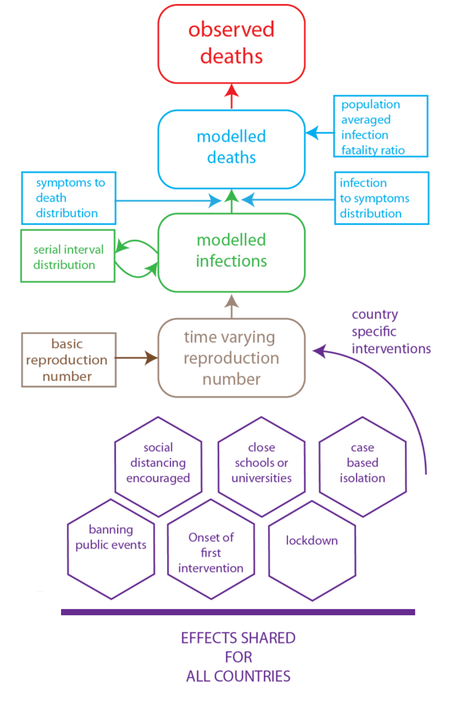

# Estimating the number of infections and the impact of nonpharmaceutical interventions on COVID-19 in 14 European countries

2020-05-12 https://mrc-ide.github.io/covid19estimates/#/ 

## Content of this website

For the COVID-19 epidemics in several European countries, estimates of

- the number of infections and
- the impact of non-pharmaceutical interventions.

## Key assumptions/model properties

- We use a Bayesian model that calculates backwards from the deaths observed over time to estimate transmission that occurred several weeks prior.
- Changes in the reproductive number – a measure of transmission - are an immediate response to interventions.
- Each intervention has the same effect on the reproduction number across countries and over time, excluding the lockdown intervention. For lockdown, we now estimate a global effect and a country specific effect.
- The interventions that we consider have different implementation details across countries, which we do not take into account.
- We make various further assumptions that our model results are contingent on (e.g. about the time between infections, about being able to observe all COVID-related deaths, about the time between infection and death and about the infection-fatality-ratio).

Data source: Daily time series data from [ECDC](https://www.ecdc.europa.eu/en/publications-data/download-todays-data-geographic-distribution-covid-19-cases-worldwide). Interventions related data can be found [here](https://imperialcollegelondon.github.io/covid19estimates/#/interventions).

More details can be found in the [original model report ](https://www.imperial.ac.uk/mrc-global-infectious-disease-analysis/covid-19/report-13-europe-npi-impact/), in the [technical model description ](https://arxiv.org/abs/2004.11342)and in the [source code ](https://github.com/ImperialCollegeLondon/covid19model)of the model.