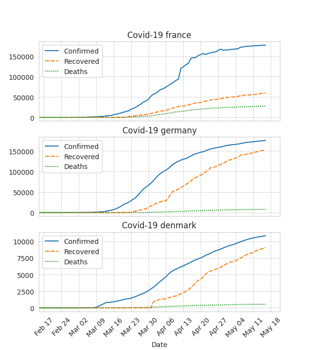
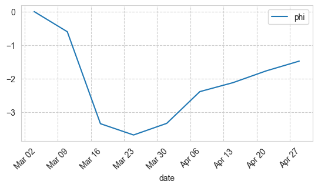

# Data summary

The purpose of this short document is to provide a summary of the data available in this repository. Currently, we focus on two countries of interest: Germany and France. All data is in the `data/processed/` directory prefixed with a country name.

## COVID-19 cases

The COVID-19 time series of confirmed cases, deaths and recoveries is sourced from the [DataHub](https://datahub.io/core/covid-19) repository, which contains cleaned and normalized dataset from [upstream repository](https://github.com/CSSEGISandData/COVID-19)  maintained by  Johns Hopkins University Center for Systems Science and Engineering, which in turn aggregates the data from various sources such as WHO, or the French government dashboard.

The data is in `{country}_covid19.csv` files with following columns (note that these are cumulative sums): `Date`, `Confirmed`, `Recovered`, `Deaths`.

## Imperial College model

As an alternative to reported cases (deaths), we can use modeling results. As an example, here are the the outputs of the model from Imperial College London, which from the reports of COVID-19 deaths estimates the number of infected individuals and the effect of the governmental interventions. 

The data is in the `{country}_imperial_college_sir.csv` and contains following columns:

* basic indices `date`,`country`
* reported cases: `reported_cases`,`reported_cases_cumulative`
* predicted cases: 
  * `predicted_infections_mean_cumulative`, `predicted_infections_lower_CI_95_cumulative`, `predicted_infections_higher_CI_95_cumulative`
* cumulative predicted cases:
  * `predicted_infections_mean`, `predicted_infections_lower_CI_95`, `predicted_infections_higher_CI_95`,
* reported deaths:`reported_deaths`,`reported_deaths_cumulative`,
* predicted deaths cumulative:
  * `estimated_deaths_mean_cumulative`, `estimated_deaths_lower_CI_95_cumulative`, `estimated_deaths_higher_CI_95_cumulative`,
* predicted deaths:
  * `estimated_deaths_mean`, `estimated_deaths_lower_CI_95`, `estimated_deaths_higher_CI_95`,
* time varying reproduction number: 
  * `mean_time_varying_reproduction_number_R(t)`, `time_varying_reproduction_number_R(t)_lower_CI_95`, `time_varying_reproduction_number_R(t)_higher_CI_95`

## Mobility reports

Google and Apple provide summary statistics derived from aggregated and anonymized sets of data from their smartphone users in particular regions (countries and sub-regions). Note that for both there is no demographic information resulting in unknown representativeness against general population. The data is in the files `{country}_{provider}_mobility_report.csv`.

Google's dataset consist of percentage change from baseline (Jan 3–Feb 6, 2020) in visits and length of stay at places grouped by following categories: Grocery & phramacy, Parks, Transit stations, Retail & recreation, Residential, and Workplaces. 

Apple's dataset contains volume of direction requests in Apple Maps relative to baseline (January 13th, 2020), and is divided by means of transport (driving, transit, walking).

Additionally, week averages are available in the files `{country}_{provider}_mobility_report_week_avg.csv`. The week average is supposed to normalize the week of the day effects, and to collapse the variables into single time-series to provide general trend. 

## COSMO survey results

The COVID-19 Snapshot Monitoring ([COSMO](https://projekte.uni-erfurt.de/cosmo2020/cosmo-analysis.html)) is a project performing repeated surveys on public knowledge, risk perception, protective behaviour, and trust during the COVID-19 outbreak. Originally developed in Germany, it is also run in parallel in few other countries, such as [Denmark](http://copsy.dk/cosmo/).

Two groups of variables were identified as having enough temporal variance to inform the $\phi$ state variable: Affect (e.g. "covid is making me helpless"), and Policies (e.g. "I'm for closing schools"). Importantly, the variables in these groups are highly correlated, which makes the aggregation easier. 

|      | variable         | Text of question (translated); Corona virus is for me...     |
| ---- | ---------------- | ------------------------------------------------------------ |
| 137  | AFF_DISTANCE     | Close - Far                                                  |
| 138  | AFF_SPREAD       | Slowly spreading - Fast spreading                            |
| 139  | AFF_THINK        | Something I keep thinking about - something I almost never think about |
| 140  | AFF_FEAR         | Frightening - Not scary                                      |
| 141  | AFF_HYPE         | Medially inflated - receiving too little media attention     |
| 142  | AFF_WORRY        | Worrying - not worrying                                      |
| 143  | AFF_HELPLESSNESS | Something where I feel helpless - something I can actively do something about |
| 626  | AFF_NOVELITY     | New - old                                                    |
| 627  | AFF_SCIENCE      | Totally unexplored - Very well researched                    |

A representative time-series was extracted as a first PCA component from the Affect variables (without AFF_HYPE, which follows slightly different trend; explained variance by the first component: 91%), and is available in the `germany_cosmo_phi.csv` file.

